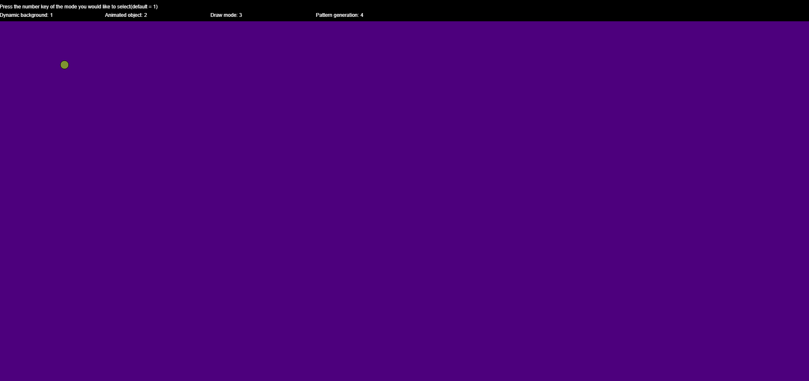
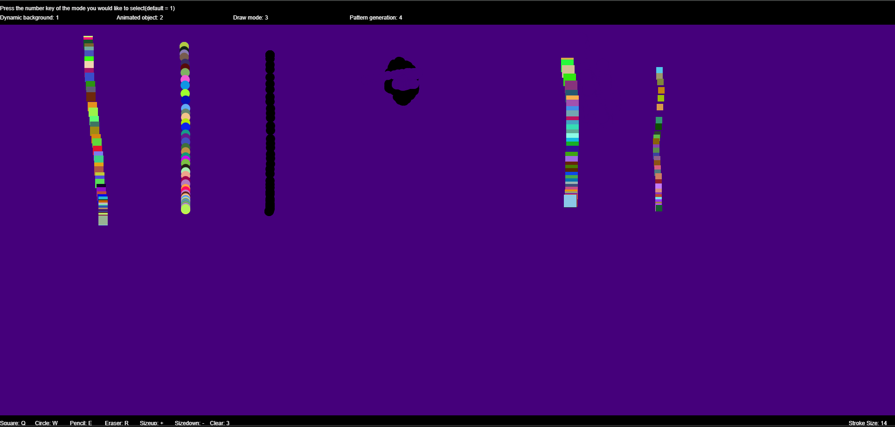
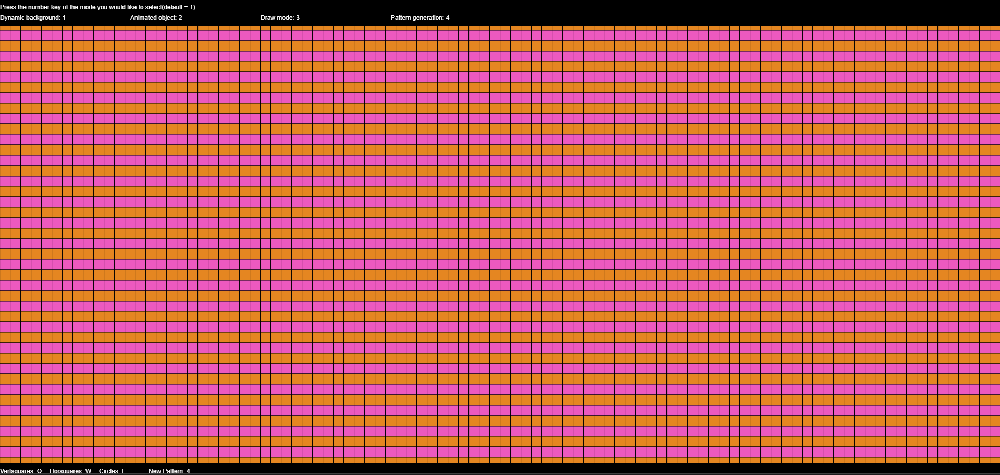
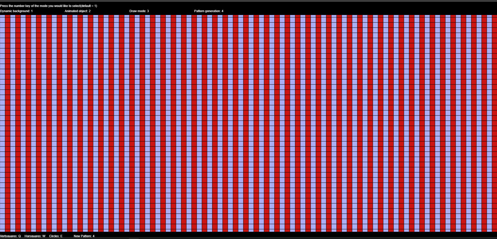
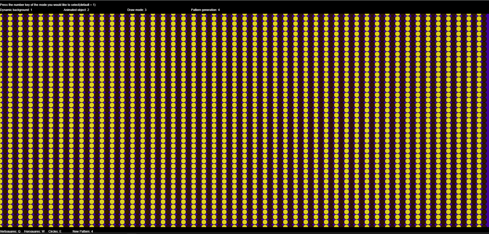

# [P5 Basics](https://github.com/Pirategirl9000/Lab1_ComputerGraphics_P5Basics)
##### Author: [Violet French](https://github.com/Pirategirl9000)

---

### Purpose
This program is to learn the p5 library by creating several mini programs inside of one large program.

---

#### Included
* [Dynamic Background Mode](#dynamicbackgroundjs)
    * The background dynamically changes as you move your mouse across the screen
* [Object Animation Mode](#animatedobjectjs)
    * A circle bounces across the screen changing colors as it hits the walls
* [Draw Mode](#drawmodejs)
    * A mode which the user can draw in allowing for mouse interactivity
* [Pattern Mode](#patterngenerationsjs)
    * Draws patterns to the screen with alternating colors

For more information on each mode see the [script breakdown](#script-breakdown)

[view the output](#output)

---

### Script Breakdown
#### sketch.js
* Purpose
    * Serves as the main script for the program
    * Handles most of the top level logic and declares variables and functions used by other scripts
* Variables & Objects
    * ###### ```MODES```
        * An enum for all the different program modes
        * Contains: ```DYNAMIC_BACKGROUND```, ```ANIMATED_OBJECT```, ```DRAW_MODE```, and ```PATTERN_MODE```
    * ###### ```backgroundColor```
        * Stores the current background color
    * ###### ```mode```
        * The current mode of the program
* Functions
    * ###### ```setup```
        * p5 function that is called at beginning of program
        * Sets ```Circle.color``` to a random color
        * Creates the canvas
    * ###### ```draw```
        * p5 function that is called once every frame
        * Handles any logic that needs to happen every frame
            * Redraws backgrounds
            * Reprints instructions
            * Updates the circle's position
            * Checks for mouse inputs in draw mode
    * ###### ```displayInstructions```
        * Displays the instructions for changing modes
    * ###### ```getRandomColor```
        * Returns a random RGB color

#### eventHandlers.js
* Purpose
    * Handles p5 events like key presses, mouse movement, and window resizing
    * Also stores all the different keys used for input
* Variables & Objects
    * ###### ```KEYS```
        * An enum storing all the different input types and their associated keys
        * Provides an easy way to change keybinds without massive refactoring
* Functions
    * ###### ```windowResized```
        * p5 function that triggers when the window is resized
        * Resizes the canvas if in dynamic background mode
            * Only does it in this mode since it causes problems if done in other modes
            * Canvas is resized to match window dimensions
    * ###### ```mouseMoved```
        * p5 function that triggers when the mouse is moved
        * Used in [dynamic background mode](#dynamicbackgroundjs) to adjust the color according to the mouse position
    * ###### ```keyPressed```
        * p5 function that triggers when a key is pressed and released
        * Used for handling all keyboard events
        * Used for changing ```mode```, ```currentDrawMode```, and ```currentPatternMode```
            * Also used for adjusting ```drawSize``` in draw mode

    
#### dynamicBackground.js
* Purpose
    * Handles all the logic pertaining to the dynamic background mode
        * Dynamic background changes the color of the background based on your mouse position
        * The x position changes the red value and the y value changes the blue value
            * green remains constant at 0
            * the value for the new color is calculated using
                * $red \approx mouseX / windowWidth * 255 $
                * $green = 0$
                * $blue \approx mouseY / windowHeight * 255$
                * Value is rounded to next whole integer
    * The background color persists when you change between the modes
* Functions
    * ###### ```dynamicBackground```
        * Calculates the new background color based on the mouse's position relative to the window's dimensions
        * See the purpose section above for how it is calculated
    * ###### ```printBackgroundColor```
        * Prints the current background color in the bottom right corner

#### animatedObject.js
* Purpose
    * This mode renders a ball that bounces off the walls of the canvas changing colors each bounce
* Variables & Objects
    * ###### ```Circle```
        * An object containing all the information pertaining to the bouncing ball
        * Attributes
            * ```x``` - The current x position of the circle
            * ```y``` - The current y position of the circle
            * ```diameter``` - The diameter of the circle
            * ```xSpeed``` - The current xSpeed of the circle
            * ```ySpeed``` - The current ySpeed of the circle
            * ```color``` - The current color of the circle
* Functions
    * ###### ```moveCircle```
        * Moves the circle according to it's ```xSpeed``` and ```ySpeed```
        * is called once every frame by ```updateAnimatedObject```
    * ###### ```updateAnimatedObject```
        * Moves the circle forward a frame, reverses it's direction & randomizing its color if it hits a wall, then redraws the circle to the canvas
        * Called once every frame by the [draw function](#sketchjs)

#### drawMode.js
* Purpose
    * This mode provides the user with tools allowing them to draw to the canvas
    * The different tools available are defined by the ```DRAWMODES```
* Variables & Objects
    * ###### ```DRAWMODES```
        * An enum containing the different draw modes for draw mode
        * Contains
            * ```SQUARE``` - draws randomly colored squares
            * ```CIRCLE``` - draws randomly colored circles
            * ```PENCIL``` - draws black circles
            * ```ERASER``` - draws circles that match the background color
            * ```SIZEUP``` - increases ```drawSize```
            * ```SIZEDOWN``` - decreases ```drawSize```
    * ###### ```currentDrawMode```
        * Stores the current draw mode which decides what to draw on LMB
    * ###### ```drawSize```
        * The size all shapes will be drawn
            * length for squares
            * diameter for circles
* Functions
    * ###### ```drawMode```
        * draws shapes based on the ```currentDrawMode``` if the left mouse button is currently held down
    * ###### ```printDrawModeInstructions```
        * Writes the instructions for draw mode in the bottom right corner
            * Prints out the keys for changing tools and the ```drawSize``` (called stroke size)

#### patternGenerations.js
* Purpose
    * This mode displays different patterns which use alternating colors that are randomized when generating the pattern
* Variables & Objects
    * ###### ```PATTERNMODES```
        * An enum that stores the different patterns and their associated key value
        * Contains
            * ```HORSQUARES``` - Squares with a horizontal color pattern
            * ```VERTSQUARES``` - Squares with a vertical color pattern
            * ```CIRCLES``` - Circles with a vertical color pattern
    * ###### ```currentPatternMode```
        * Stores the current pattern mode
    * ###### ```shapeSize```
        * Stores the size each shape should be
            * length for squares
            * diameter for circles
* Functions
    * ###### ```patternMode```
        * Calls the function associated with whatever the ```currentPatternMode``` is
        * Called when ```currentPatternMode``` [changes](#eventhandlersjs) or when [switching](#eventhandlersjs) to pattern mode
    * ###### ```drawVertSquarePattern```
        * Draws a pattern of alternating color squares whose colors align vertically
        * Colors are randomly determined when called
    * ###### ```drawHorSquarePattern```
        * Draws a pattern of alternating color squares whose colors align horizontally
        * Colors are randomly determined when called
    * ###### ```drawCirclePattern```
        * Draws a pattern of alternating color circles whose colors align vertically
        * Colors are randomly determined when called
    * ###### ```printPatternModeInstructions```
        * Prints the instructions for interacting with pattern mode

---
### Output
##### Dynamic Background

##### Animated Object

##### Draw Mode

##### Pattern Generation


